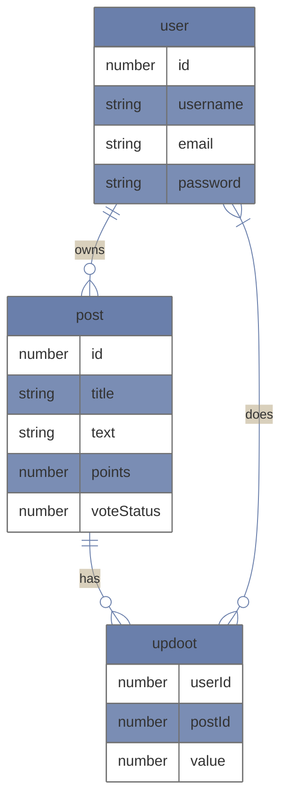

# ER図

```mermaid
%%{init:{'theme':'base','themeVariables':{'primaryColor':'#6A7FAB','lineColor':'#6A7FAB','background':'#FFF'}}}%%


erDiagram

user ||--o{ post : owns
post ||--o{ updoot : has
user }|--o{ updoot : does

user {
  number id
  string username
  string email
  string password
}

post {
  number id
  string title
  string text
  number points
  number voteStatus
}

updoot {
  number userId
  number postId
  number value
}
```
