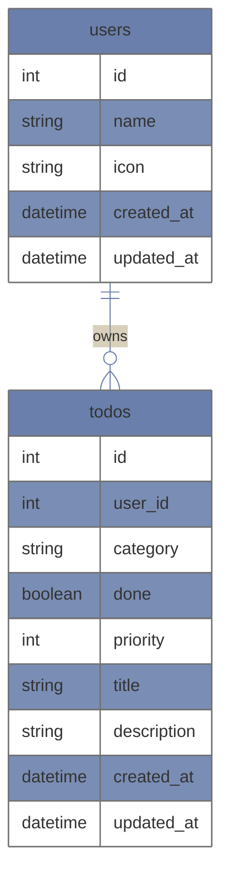

# ER図

```mermaid
%%{init:{'theme':'base','themeVariables':{'primaryColor':'#6A7FAB','lineColor':'#6A7FAB','background':'#FFF'}}}%%


erDiagram

users ||--o{ todos : owns

users {
  int id
  string name
  string icon
  datetime created_at
  datetime updated_at
}

todos {
  int id
  int user_id
  string category
  boolean done
  int priority
  string title
  string description
  datetime created_at
  datetime updated_at
}
```
