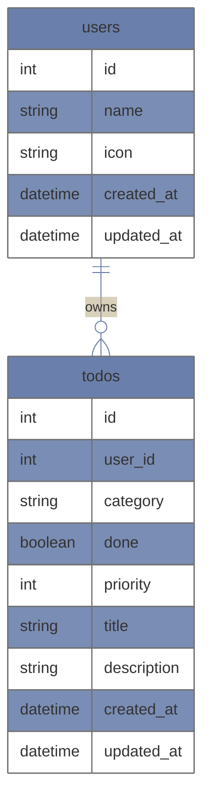

# やれたらやるチーム server repository
**色々お勉強系資料**
- deploy手順 
https://github.com/do-it-if-i-can/server/tree/master/doc/deploy.md

- gqlgen
https://github.com/do-it-if-i-can/server/tree/master/doc/gqlgen.md

- graphql-schema
https://github.com/do-it-if-i-can/server/tree/master/doc/graphql-schema.md

- gqlgen*goのsample repository
https://github.com/alexzimmer96/gqlgen-example

## 開発環境

- start up container (launch local graphiQL)

```
docker-compose up -d
```

- go file generate from schema

```
 go run gqlgen.go
```


- after go get 

```
go mod vendor
```

- deploy
→ TODO: デプロイ用workflow作る

- access to local db

```
mysql -h 0.0.0.0 -P 3306 -u root -p
```

## 技術

- Docker, docker-compose
- gin 
- gorm 
- gqlgen 
- [PlanetScale](https://planetscale.com/)
- GCP(GCR, CloudRun, CloudScheduler, CloudFunctions, Pub/Sub)
- Github Actions
- Terraform

## アーキテクチャ


### core concept

[こちら](https://github.com/alexzimmer96/gqlgen-example/blob/master/graphql-example-architecture.png)のような以下の各層に処理を分けたアーキテクチャとなります。
- resolver
- service
- repository

### ディレクトリ構成(draft, 変えたい)
```
- cmd/main.go (アプリケーションのエントリポイント)
- /doc (メモ用)
- /terraform (tfファイル格納用)
- /graph (graphqlに関するディレクトリ)
 - /generated (schemaを元に生成されるgoコード)
 - /model (modelとなるgoのコード)
 - /schema (graphql schema SDLで記述されたschemaを格納する、このschemaを元に各コードが自動生成される)
 - resolver.go (自分でresolverを追加定義する場所)
 - *.resolvers.go (schemaによって自動生成されるresolver, schema配下のファイルと1対1になる)
```
## データベース

- local
  - Docker(MySQL)
- prod
  - PlanetScale(MySQL)

## ER図



## CI/CD
### Actions(WIP)
- server-prod-release
  - サーバーのprod環境へのデプロイworkflow?
- generate-client-graphql
  - graphqlリポジトリへのts生成workflow(server/graph/schema/ ディレクトリ配下の変更をhookして動作する)
- backend
  - lintやtestなどを行うworkflow, pullreqest時に毎回動作する?

## コミットルール

- gitmojiを使用

## ブランチルール
masterを元にブランチを切ってPRを出す。

命名規則は以下に従う
[feature, fix, refactor, doc, test, env]/zzz-zzzXzz

例： feature/todo-get-api
